<div align="center">

<!-- Logo区域 -->


# 🤖 AI驱动的自动化测试平台

<p align="center">
  <em>智能化 · 自动化 · 高效率</em>
</p>

<!-- 徽章区域 - 莫兰迪配色 -->
<p align="center">
  
  
  
  
</p>

---

### 🎯 让AI为你的测试工作提速

一个集成多AI引擎的智能测试平台，自动生成测试用例、执行自动化测试，<br/>
让测试工作从繁琐变为智能，从重复变为创新

<br/>

</div>

---

## ✨ 核心特性

<table>
<tr>
<td width="50%" valign="top">

### 🧠 智能生成
- **AI驱动的用例生成**  
  基于页面结构自动创建测试场景
  
- **多引擎支持**  
  DeepSeek · Claude · OpenAI

- **上下文理解**  
  智能识别业务逻辑与测试点

</td>
<td width="50%" valign="top">

### ⚡ 自动执行
- **无人值守测试**  
  自动登录、导航、填充数据
  
- **智能元素定位**  
  AI增强的元素识别能力

- **脚本自动生成**  
  输出标准Selenium代码

</td>
</tr>
</table>

<div align="center">

### 📊 完整的测试闭环

```mermaid
graph LR
    A[🎯 分析页面] --> B[🧠 AI生成用例]
    B --> C[⚙️ 自动执行]
    C --> D[📈 生成报告]
    D --> E[🔄 持续优化]
    style A fill:#A8B5A0,stroke:#4A5568,stroke-width:2px,color:#2D3748
    style B fill:#B8A398,stroke:#4A5568,stroke-width:2px,color:#2D3748
    style C fill:#9EABB3,stroke:#4A5568,stroke-width:2px,color:#2D3748
    style D fill:#C4B5A0,stroke:#4A5568,stroke-width:2px,color:#2D3748
    style E fill:#BCA89F,stroke:#4A5568,stroke-width:2px,color:#2D3748
```



</div>

---

## 🚀 快速开始

### 📋 前置要求

```bash
Node.js >= 18.0.0
npm >= 9.0.0
Chrome/Chromium 浏览器
```

### 🔧 安装步骤

```bash
# 1️⃣ 克隆项目
git clone https://github.com/yourusername/ai-testing-platform.git
cd ai-testing-platform

# 2️⃣ 安装依赖
npm install

# 3️⃣ 配置环境
cp .env.example .env

# 4️⃣ 启动服务
npm start
```

### ⚙️ 环境配置

在 `.env` 文件中配置你的AI服务密钥:

```env
# DeepSeek API
DEEPSEEK_API_KEY=your_deepseek_key_here

# Claude API (可选)
CLAUDE_API_KEY=your_claude_key_here

# OpenAI API (可选)
OPENAI_API_KEY=your_openai_key_here

# 服务配置
PORT=3000
```

---

## 💡 使用示例

<details>
<summary><b>📝 基础测试流程</b></summary>

```javascript
// 1. 初始化测试
const tester = new AITester({
  engine: 'deepseek',
  url: 'https://example.com'
});

// 2. 生成测试用例
const testCases = await tester.generateTestCases();

// 3. 执行自动化测试
const results = await tester.execute(testCases);

// 4. 生成报告
await tester.generateReport(results);
```

</details>

<details>
<summary><b>🎨 自定义测试场景</b></summary>

```javascript
const customTest = {
  name: '用户登录流程',
  steps: [
    { action: 'navigate', url: '/login' },
    { action: 'fill', selector: '#username', value: 'testuser' },
    { action: 'fill', selector: '#password', value: 'password123' },
    { action: 'click', selector: '#submit' },
    { action: 'assert', condition: 'url.includes("/dashboard")' }
  ]
};

await tester.run(customTest);
```

</details>

---

## 🏗️ 技术架构

```
┌─────────────────────────────────────────────────────┐
│                    前端界面层                          │
│          React + TypeScript + Tailwind              │
└──────────────────┬──────────────────────────────────┘
                   │
┌──────────────────▼──────────────────────────────────┐
│                  AI引擎层                             │
│      DeepSeek · Claude · OpenAI 多引擎支持            │
└──────────────────┬──────────────────────────────────┘
                   │
┌──────────────────▼──────────────────────────────────┐
│                自动化执行层                            │
│         Puppeteer + Selenium WebDriver              │
└──────────────────┬──────────────────────────────────┘
                   │
┌──────────────────▼──────────────────────────────────┐
│                报告生成层                              │
│           HTML Reports + JSON Logs                  │
└─────────────────────────────────────────────────────┘
```

---

## 📚 项目结构

```
ai-testing-platform/
├── 📁 src/
│   ├── 📁 ai/              # AI引擎集成
│   ├── 📁 automation/      # 自动化脚本
│   ├── 📁 generators/      # 用例生成器
│   └── 📁 reports/         # 报告生成
├── 📁 tests/               # 测试文件
├── 📁 docs/                # 文档
├── 📄 .env.example         # 环境配置模板
├── 📄 package.json         # 项目配置
└── 📄 README.md            # 项目说明
```

---

## 🤝 参与贡献

我们欢迎所有形式的贡献！

<div align="center">

### 贡献方式

| 类型 | 说明 |
|:---:|:---|
| 🐛 | **Bug报告** - 提交Issue描述问题 |
| ✨ | **新功能** - Fork后提交Pull Request |
| 📖 | **文档改进** - 完善使用文档 |
| 💡 | **想法建议** - 在Discussion中讨论 |

</div>

### 开发指南

```bash
# 安装开发依赖
npm install --dev

# 运行测试
npm test

# 代码格式化
npm run format

# 构建项目
npm run build
```

---

## 📄 开源协议

本项目基于 [MIT License](LICENSE) 开源协议

---

<div align="center">

### 🌟 如果觉得有帮助,请给个Star吧!


<br/>

**Made with ❤️ by CinfyX**

<sub>Powered by AI · Built for Testers</sub>

---


[🐛 报告问题](https://github.com/C1nfy/ai-testing-platform/issues) · 
[💬 讨论](https://github.com/C1nfy/ai-testing-platform/discussions)

</div>
